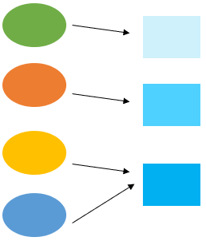

> **Hash tables can be seen as *indexed arrays* via hash functions**.  Hash tables are slightly fancier version of arrays. 

- [hash table the basics](#hash-table-the-basics)
  - [hash function](#hash-function)
    - [one-to-one or many-to-one](#one-to-one-or-many-to-one)
    - [Deterministic](#deterministic)
- [Hash tables in Python](#hash-tables-in-python)
  - [defaultdict](#defaultdict)
  - [Counter](#counter)
  - [Hash table examples](#hash-table-examples)
    - [Find anagram](#find-anagram)

# hash table the basics

A hash table is a data structure that is like a Python dictionary. It is designed to store keys (and optionally) with associated values in an **array**.  

A key is stored in the array locations based on its hash code, which is an integer $$\text{hash code}=\text{array index}=f(\text{input key})$$.  

Hash function maps keys to array indices. 

Hash codes are integers that are array indices. 

Compare with binary search trees (BSTs), hash tables are more efficient in access (find), insert and delete, as long as we have a good hash function. 
* Time complexity: find, insert, and delete all in $$O(1)$$ time if we have a good hash function.   


## hash function
A good hash function distributes hash codes uniformly through the array locations, which prevents collision as much as possible and promotes super fast access, insertion and deletion. 

* Hash keys must be unique.  
* But different keys can map to the same value (think frequency tables: different things can have the same count)

### one-to-one or many-to-one
> **Same keys must map to the same hash code**.  Although not in any way related, but same keys to a lock should both open it, right? 



Hash functions are one-to-one or many-to-one.  **It can never ben one to many!**

$$ \text{If}x=y \text{then} f(x)=f(y)$$
$$ \text{Converse is not true}$$

In other words
$$f(x)=f(y)$$
then
$$x \text{ may or may not}=y$$

Usage:  If we have already computed the hash, then it suffices to compare the hashed instead of the originals.

1. Compare hashed $$f(x)$$ and $$f(x)$$; if not equal, then $$x$$ and $$y$$ are definitely not equal
2. If the hashed are equal, then we have to compare $$x$$ and $$y$$ bit by bit to see if they are indeed equal or due to collision

### Deterministic

Hash function (input and output) must be constant (stay the same).  Therefore, many programming languages require hash keys be immutable.  In Python dictionary, keys can be strings or integers, which are immutable. 

# Hash tables in Python

Python has 4 built-in hash table types: *set*, *dict*, *collections.defaultdict*, *collections.Counter*, where a set only stores keys.

## defaultdict 
<span class="coding">collections.defaultdict</span> is nothing but a <span class="coding">dict</span> with an added option to specify default, so that error can be prevented if key is not found. 

## Counter

The Counter class creates a frequency table associated with the input. 

<div class="code-head"><span>code</span>Counter.py</div>

```py
c = Counter()                                 # a new, empty counter
c = Counter('hello')                          # a new counter from an iterable such as string or list
print(c)
# Counter({'l': 2, 'h': 1, 'e': 1, 'o': 1})
c = Counter({'high': 100, 'low': 5000})       # a new counter from a mapping
# Counter({'low': 5000, 'high': 100})
c = Counter(high=100, low=5000)                   # a new counter from keyword args
```

## Hash table examples

### Find anagram 

In Python, a string is a sequence (list) of unicode. So when we apply the <span class="coding">sorted</span> method, the letters become separated individuals sorted in a sequence.  

The sorted sequence of the letters are joined without space.  It becomes the representative of its anagram group.  

> This reminds me of class representatives in math.  

A set of class representatives is a subset of X which contains exactly one element from each [equivalence class](https://en.wikipedia.org/wiki/Equivalence_class)

An equivalence relation on a set {\displaystyle X}X is a binary relation {\displaystyle \,\sim \,}\,\sim\, on {\displaystyle X}X satisfying the three properties:[6][7]

{\displaystyle a\sim a}{\displaystyle a\sim a} for all {\displaystyle a\in X}a\in X (reflexivity),
{\displaystyle a\sim b}a\sim b implies {\displaystyle b\sim a}{\displaystyle b\sim a} for all {\displaystyle a,b\in X}{\displaystyle a,b\in X} (symmetry),
if {\displaystyle a\sim b}a\sim b and {\displaystyle b\sim c}{\displaystyle b\sim c} then {\displaystyle a\sim c}{\displaystyle a\sim c} for all {\displaystyle a,b,c\in X}a,b,c\in X (transitivity).

Here we use <span class="coding">defaultdict</span> as the hashtable. 

<div class="code-head"><span>code</span>anagram.py</div>

```py
from collections import defaultdict
def find_anagram(wordList):
    dd = defaultdict(list)
    for word in wordList:
        print(word, sorted(word))
        dd[''.join(sorted(word))].append(word)
    return dd

words = ['debitcard','badcredit', 'below', 'taste','state','elbow', 'listen','levis', 'elvis', 'lives','freedom']

d = find_anagram(words)
for k, w in d.items():
    if len(w) > 1:
        print('equivalent to: {}, {}'.format(k, w))
# Out:
# debitcard ['a', 'b', 'c', 'd', 'd', 'e', 'i', 'r', 't']
# badcredit ['a', 'b', 'c', 'd', 'd', 'e', 'i', 'r', 't']
# below ['b', 'e', 'l', 'o', 'w']
# taste ['a', 'e', 's', 't', 't']
# state ['a', 'e', 's', 't', 't']
# elbow ['b', 'e', 'l', 'o', 'w']
# listen ['e', 'i', 'l', 'n', 's', 't']
# levis ['e', 'i', 'l', 's', 'v']
# elvis ['e', 'i', 'l', 's', 'v']
# lives ['e', 'i', 'l', 's', 'v']
# freedom ['d', 'e', 'e', 'f', 'm', 'o', 'r']
# equivalent to: abcddeirt, ['debitcard', 'badcredit']
# equivalent to: below, ['below', 'elbow']
# equivalent to: aestt, ['taste', 'state']
# equivalent to: eilnst, ['listen']
# equivalent to: eilsv, ['levis', 'elvis', 'lives']
```

