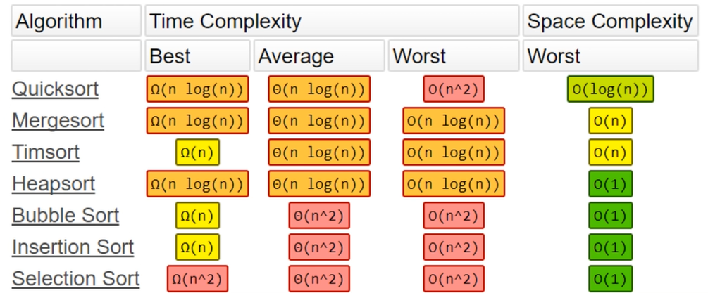

The basic data structures in Python are: dictionary, list, special lists (linked list, stack, queue). 
Basic algorithms: recursion, sorting (select sort, bubble sort, quick sort).

Sorting algorithms are very important.  In the Women in Mathematics summer program that I participated in Washington DC 2006 during my college junior year, the NSA director of mathematics came and gave us (16 women math college students from around the country) a talk on sorting algorithms.  The fact that he chose to talk about sorting made me realize it is importance.  For examples:

When things are sorted, you can find order much faster, for example, percentiles.  
The [binary search algorithm](2022-06-22-1-binary-search.md) works on a sorted array.  



# Quick sort

The quick sort algorithm reminds me of binary search.  

In binary search on a sorted array, we half the search range by comparing target with the median of the search range.  

Quick sort works by sorting as if we only care about sorting into two parts: larger and smaller.  The element that is used to split the original array into two parts is commonly called the "pivot".  

Then we apply the same method to each of the two parts, and continue until each of the parts has only 1 element (cannot be splited anymore).  


- Starting from the left side of the search range, **the goal is to move all elements smaller than the pivot to the left** (and therefore all elements larger than the pivot are moved to the right). 
  - the search range is 

# Merge sort

# Bucket sort


# Bubble sort


<div class="code-head"><span>code</span>bubble sort.py</div>

```python
def bs(a):
    sorted= False
    while not sorted:
        sorted = True # for getting out the while loop
        for i in range(0, len(a)-1):
            if a[i]>a[i+1]:
                sorted=False
                a[i], a[i+1] = a[i+1],a[i]
    return a
a = [4,9, 100, 1, 0,8,2]
print(bs(a))
# [0, 1, 2, 4, 8, 9, 100]
```


# Select sort


<div class="code-head"><span>code</span>select sort.py</div>

```python
def ss(a):
    for i in range(0, len(a)-1):
        min_index = i
        for j in range(i,len(a)):
            if a[j]< a[min_index]:
                min_index=j
        a[i],a[min_index] =a[min_index], a[i]

    return **a**
a = [4,9, 100, 1, 0,8,2]
print(ss(a))
# [0, 1, 2, 4, 8, 9, 100]
```
## Quick sort (not in place)
<div class="code-head"><span>code</span>quick_sort_0.py</div>

```python
def qs(a):
    if len(a)< 2:
       return a
    else:
        small = []
        big = []
        pivot = a.pop()
        for i in range(0,len(a)):
            if a[i]> pivot:
                big.append(a[i])
            else:
                small.append(a[i])
    return qs(small)+[pivot] + qs(big)
print(qs(a))
# [0, 1, 2, 4, 8, 9, 100]
```


```python

>>> a = 'Hello, how are you'
>>> r = rotate(a,7)
>>> print(r)
Out:
how are youhello,
```

# rotate a numpy array

We can recycle the previous code for rotating a list.  The 2 differences are:
1. use <span class="coding">np.concatenate</span> instead of <span class="coding">+</span>.
2. use <span class="coding">axis=None</span> such that the numbers are joined without using any axis. 

If we have inputs of multiple dimensions, we can just reshape or flatten them, and rotate accordingly to what we want to achieve. 

```python
>>> def rotate_array(a,k):
>>>        if k==0: return a
>>>        k = k%len(a)
>>>        return (np.concatenate((a[k:],a[:k]), axis=None))
>>> a = np.array([1,2,3,4,5,6])
>>> r = rotate_array(a,2)
>>> print(r)
Out:
array([3,4,5,6,1,2])

```

<span class="coding">np.dot</span> as the name implies, gives a dot product.  The result is a single number. 
