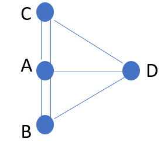

- [Introduction](#introduction)
  - [Use namedtuple](#use-namedtuple)
  - [Use adjacency list](#use-adjacency-list)
  - [Use adjacency matrix](#use-adjacency-matrix)


# Introduction

In mathematics, graph is a pair of two sets.
$$G=(V,E), 
where $$V$$ is the set of vertices, and $$E$$ is the set of edges.

For example, 
$$V={0, 1, 2, 3}$$
$$E={(0, 1),(0, 2), (0, 3),(2, 3}$$



For example, 
$$V={A, B, C, D}$$
$$E={(A,B),(A,B), (A,C), (A,C), (B,D), (A,D), (C,D)$$
The set of $$E$$ is called a multi-set because it contains "duplicates". 

Graphs are useful for representing relationships.


## Use namedtuple
<div class="code-head"><span>code</span>graph1.py</div>

```python
# G = (V, E)
# [0, 1, 3, 9, 100]
```

<div class="code-head"><span>code</span>graph representation using namedtuple.py</div>

```python
from collections import namedtuple
Graph = namedtuple("Graph", ["vertice", "edge"])
apple = ['A','B', 'C', 'D']
banana =[
    ('A','B'),
    ('A','B'),
    ('A','C'),
    ('A','C'),
    ('A','D'),
    ('B','D'),
    ('C','D'),
]
G = Graph(apple,banana)
print(G)
# Graph(vertice=['A', 'B', 'C', 'D'], edge=[('A', 'B'), ('A', 'B'), ('A', 'C'), ('A', 'C'), ('A', 'D'), ('B', 'D'), ('C', 'D')])
```

## Use adjacency list

Adjacency list groupbys the vertices and lists out their immediate neighbors. 

$$A: B, B, C, C, D$$
$$B: A, A, D$$
$$C: A, A, D$$
$$D: A, B, C$$

<div class="code-head"><span>code</span>graph representation using namedtuple.py</div>

```python
from collections import namedtuple

Graph = namedtuple("Graph", ["vertice", "edge"])
apple = ['A','B', 'C', 'D']
banana =[
    ('A','B'),
    ('A','B'),
    ('A','C'),
    ('A','C'),
    ('A','D'),
    ('B','D'),
    ('C','D'),
]
G = Graph(apple,banana)
print(G)
# Graph(vertice=['A', 'B', 'C', 'D'], edge=[('A', 'B'), ('A', 'B'), ('A', 'C'), ('A', 'C'), ('A', 'D'), ('B', 'D'), ('C', 'D')])
def adja_dict(graph):
    """
    Returns the adjacency list representation of graph
    """
    adj = {node:[] for node in graph.nodes}
    print(adj)
    for edge in graph.edges:
        print("\nedge is ", edge)
        node1, node2 = edge[0], edge[1]
        print("node1, node2", node1, node2)
        adj[node1].append(node2)
        print("adj: ", adj)
        adj[node2].append(node1)
        print("adj: ", adj)
    return adj
aG = adja_dict(G)
print(aG)
```

## Use adjacency matrix
