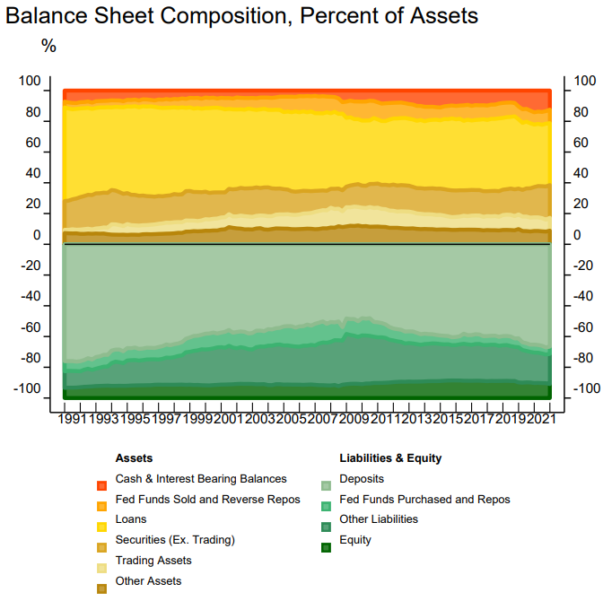
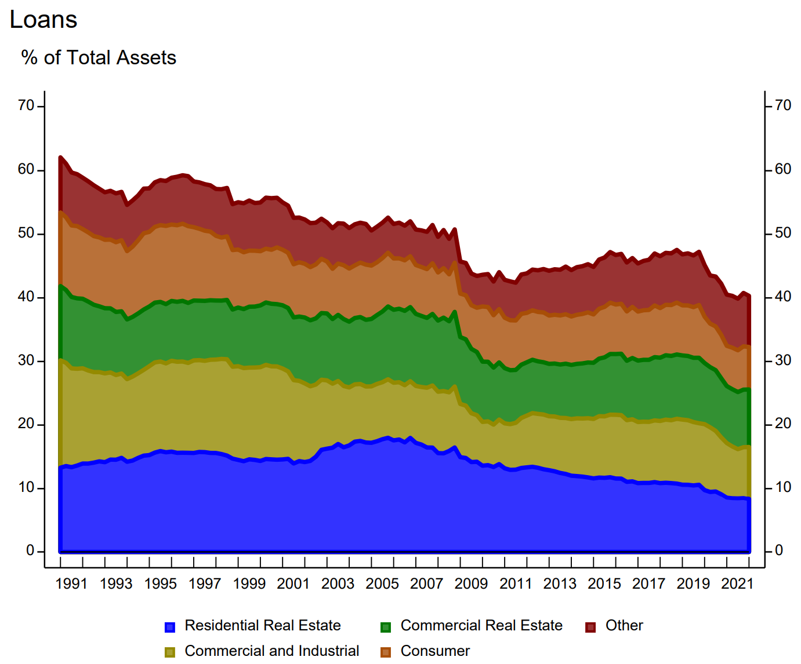
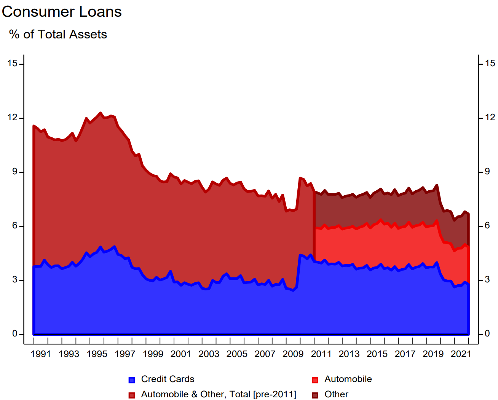

This post is a study on the bank balance sheet composition based on "Quarterly Trends for Consolidated U.S. Banking Organizations, First Quarter 2022" published by the Federal Reserve Bank of New York. The study can be used for benchmark for your own bank, and for study of what is happening to the banking industry as a whole and a glimpse of the overall US economy. 

Consolidated financial statistics for the U.S. commercial banking industry, including both bank holding companies (BHCs) and banks. Statistics are based on quarterly regulatory filings. Statistics are inclusive of BHCs' nonbank subsidiaries. 

Look at it from distribution perspective overtime:

# Q1 2022 recent trends
• Decreased return on equity and return on assets both decreased from 11.06% and 1.06% in 2021:Q4 to
10.34% and 0.93% in 2022:Q1 respectively, reflecting an **increase in quarterly loan loss provisions and noninterest expense**.

• Net interest margin remains low, (net interest margin defined as net interest income as a percentage of interest earning assets),
remained the same as last quarter at 2.10%. The current net interest margin of 2.10% is below its post-crisis (2009:Q1 – 2022:Q1) average of 2.61%.

• Reduced noninterest income ratio, measured as noninterest income as a percentage of total assets, declined from 1.96% in 2021:Q4 to 1.90% in 2022:Q1, which is below its post-crisis average of 2.17%.

• Slower asset growth from 8.29% in 2021:Q4 to 6.26% in 2022:Q1. However, *loan growth rose from 3.99% to 4.83%*. So, which asset growth decreased the most? 

• Significant decreased domestic deposit growth from 12.55% to 8.94%.

• Capital remains high by historical standards. Common equity tier 1 (CET1) capital as a percentage of risk-weighted assets (RWA) stands at 12.41%, well above its pre-crisis (2001:Q1 – 2007:Q3) average of 8.25%.

# Composition of Banking Industry Assets and Liabilities

The 30-year chart shows that industry assets grew from about $4 Trillion in 1991 to over $25 Trillion in 2021. 

Image from [New York Fed Quarterly Trends for Consolidated U.S. Banking Organizations](https://www.newyorkfed.org/research/banking_research/quarterly_trends.html)

The composition chart below shows that on the asset side:
- The *Cash & Interest Bearing Balances* category slowly decreased from 1991 until the Great Financial Crisis (GFC), and then grew significantly after the crisis. 
- The *Fed Funds Sold and Reverse Repos* category increased slowly since the 90s and remain steady as a percent of total assets.
- The *Loans* category has been shrinking over the last 30 years from about 60% to 40%.  That's a 1/3 drop. 
And from the liability side:
- Deposits were close to 80% of liability in 1991. Then it decrased over time in sync with the decreases in loans until the crisis.  These traditional banking activities increased again after the crisis.
- Two other liability categories also have moved in the same direction as deposits. 
The equities has only very mild increase in the 30 year period.

# Federal Funds Sold and Purchased

Both Fed Funds sold and purchased as percent of total assets have been dropping over time since 2002 when the data was available. Note: These charts begin in 2002:Q1 because data for repurchase agreements and federal funds are not consistently reported separately prior to that date. 

# Repurchase Agreements

Repo and reverse repo seem to be negatively correlated in a zero-sum game fashion over time since 2002 when the data was available. Note: These charts begin in 2002:Q1 because data for repurchase agreements and federal funds are not consistently reported separately prior to that date. 

# Loans
We already know that loans as % of total assets have dropped over the last 30 years.  However, looking closely, we see that the decrease mainly come from *Residential Real Estate, C&I, and consumer*.  CRE loans as % of total assets has remained more or less the same. 

## consumer loans
Among consumer loans, it is worth taking a closer look at the breakdown between credit cards, auto and other.  It seems that *credit cards have remained more or less around 3% of total assets*.  

# Reference

[Quarterly Trends for Consolidated U.S. Banking Organizations
First Quarter 2022
Federal Reserve Bank of New York](https://www.newyorkfed.org/medialibrary/media/research/banking_research/quarterlytrends2022q1.pdf?la=en)