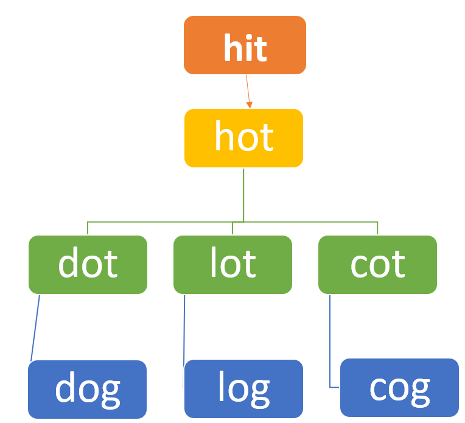

Quote from [Wikipedia](https://en.wikipedia.org/wiki/Word_ladder) "Word ladder (also known asdoublets, word-links, change-the-word puzzles, paragrams, laddergrams, or word golf) is a word game invented by Lewis Carroll..


# Problem
The problem is [Leetcode 127. Word Ladder](https://leetcode.com/problems/word-ladder/).  
 
Given two words, beginWord and endWord, and a wordList, return the number of words in the **shortest**  word ladder from beginWord to endWord, or 0 if no such sequence exists.



Example 1:

Input: beginWord = "hit", endWord = "cog", wordList = ["hot","dot","dog","lot","log","cog"]
Output: 5

Example 2:

Input: beginWord = "hit", endWord = "cog", wordList = ["hot","dot","dog","lot","log"]
Output: 0

# Class representative hash table - adjacency dictionary + BFS
For each word in the wordList, and the beginning word, we mask one letter at a time.  For the word "hot", since it has 3 letters, there are 3 ways to mask it. \*ot, h\*t, and ho\*.

Let these masked words be class representatives (dictionary keys).  And the respective classes that they represent are lists of relatives who would be the same as each other if masked at the same position.  For example, the three class representatives have the following classes: 

*ot ['hot', 'dot', 'lot', 'cot']

h*t ['hot', 'hit']

ho* ['hot']

## Build class representative hashtable or adjacency dictionary
We first build an adjacency dictionary, where class representative is they, and the class contains words that can be represented by the representative. 

Then we traverse the graph (represented by the adjacency dictionary) using BFS, layer by layer, and check if anyone we encounter is the endWord "cog".  Each layer we visit adds 1 to the ladder. 

Each layer are the neighbors of the previously visited word.  We begin with "hit", and pop it.  Its immediate neighbors ['dot', 'lot', 'cot'] are added to the que.  We pop them one by one.  Then their immediate neighbors ['dog', 'log', 'cog'] are added to the que.   Again, we pop them one by one.  When "cog" was popped, we returen the number of layers and we are done. 

Using <span class="coding">for k, v in clsTbl.items(): print(k, v)</span>, the entire class representation table is revealed as followed:
```python
*ot ['hot', 'dot', 'lot', 'cot']
h*t ['hot', 'hit']
ho* ['hot']
d*t ['dot']
do* ['dot', 'dog']
*og ['dog', 'log', 'cog', 'fog']
d*g ['dog']
l*t ['lot']
lo* ['lot', 'log']
l*g ['log']
c*g ['cog']
co* ['cog', 'cot']
f*g ['fog']
fo* ['fog']
c*t ['cot']
*it ['hit']
hi* ['hit']
```

## How do we guarantee shortest
When there are multiple members in a class representation, the path may not be unique.  But breadth-first search guarantees shortest.  This is because the class representations are exhaustive. 

**Each layer in BFS = members of three associated classes from the word just visited (or popped)**, if members have not visited yet. 

We pop (check) them one by one <span class="coding">word = que.popleft()</span> using the queue structure.  As soon as we find the target word, the search is immediately ended.   

<div class="code-head"><span>code</span>word ladder.py</div>

```py
from collections import deque, defaultdict
def seqLength(start, end, w_lt): # start=beginWord; end=endWord
    if end not in w_lt:
        return 0 
    # build adjacency dictionary
    clsTbl = defaultdict(list)
    w_lt.append(start) # because w_lt does not have begin word
    for word in w_lt:
        for i in range(len(word)):
            clsTbl[word[:i] + "*" + word[i+1:]].append(word) 
    # BFS
    visit = set([start])
    que = deque()
    que.append(start)
    res = 1
    while que:
        for i in range(len(que)):
            word = que.popleft()
            if word == end:
                return res # exit 出口
            for j in range(len(word)):
                for value in clsTbl[word[:j] + "*" + word[j+1:]]:
                    if value not in visit:
                        que.append(value)
                        visit.add(value)
        res += 1
    return 0
beginWord = "hit";  endWord = "cog";  wordList = ["hot","dot","dog","lot","log","cog", "fog", "cot"]
print(seqLength(beginWord, endWord, wordList))
# 4
```


# Appendix
I added lots of print statements to the let the executed code explain for itself the process. 

<div class="code-head"><span>code</span>word ladder_explain_version.py</div>

```py
from collections import deque, defaultdict
def seqLength(start, end, w_lt): # start=beginWord; end=endWord
    if end not in w_lt:
        return 0 # exit 出口 for edge case
    # build adjacency dictionary
    clsTbl = defaultdict(list)
    w_lt.append(start) # because w_lt does not have begin word
    for word in w_lt:
        for i in range(len(word)):
            # ||词||个 keys, 如果词长度是3， 就有3个keys
            clsTbl[word[:i] + "*" + word[i+1:]].append(word) 
    # for k, v in clsTbl.items(): # for explaination
    #     print(k, v)
    # BFS
    visit = set([start])
    # print("visit begins with: ", visit)
    que = deque()
    que.append(start)
    # print('que begins with', que)
    res = 1
    while que:
        # print("\n****************************************\n", que)
        for i in range(len(que)):
            word = que.popleft()
            # print('\npopped ', word)
            if word == end:
                return res # exit 出口
            for j in range(len(word)):
                for value in clsTbl[word[:j] + "*" + word[j+1:]]:
                    if value not in visit:
                        que.append(value)
                        # print("Add to que ", value)
                        visit.add(value)
            # print("i:", i)
        res += 1
        print("current res is ", res)

    return 0
beginWord = "hit";  endWord = "cog";  wordList = ["hot","dot","dog","lot","log","cog", "fog", "cot"]
# beginWord = "hit";  endWord = "cog";  wordList = ["hot","dot","dog","lot","log","cog"]
print(seqLength(beginWord, endWord, wordList))
[Out]:
*ot ['hot', 'dot', 'lot', 'cot']
h*t ['hot', 'hit']
ho* ['hot']
d*t ['dot']
do* ['dot', 'dog']
*og ['dog', 'log', 'cog', 'fog']
d*g ['dog']
l*t ['lot']
lo* ['lot', 'log']
l*g ['log']
c*g ['cog']
co* ['cog', 'cot']
f*g ['fog']
fo* ['fog']
c*t ['cot']
*it ['hit']
hi* ['hit']
visit begins with:  {'hit'}
que begins with deque(['hit'])

****************************************
 deque(['hit'])

popped  hit
Add to que  hot
i: 0
current res is  2

****************************************
 deque(['hot'])

popped  hot
Add to que  dot
Add to que  lot
Add to que  cot
i: 0
current res is  3

****************************************
 deque(['dot', 'lot', 'cot'])

popped  dot
Add to que  dog
i: 0

popped  lot
Add to que  log
i: 1

popped  cot
Add to que  cog
i: 2
current res is  4

****************************************
 deque(['dog', 'log', 'cog'])

popped  dog
Add to que  fog
i: 0

popped  log
i: 1

popped  cog
4
```

# Future reading
[Wolfram.com, The Longest Word Ladder Puzzle Ever](https://blog.wolfram.com/2012/01/11/the-longest-word-ladder-puzzle-ever/)