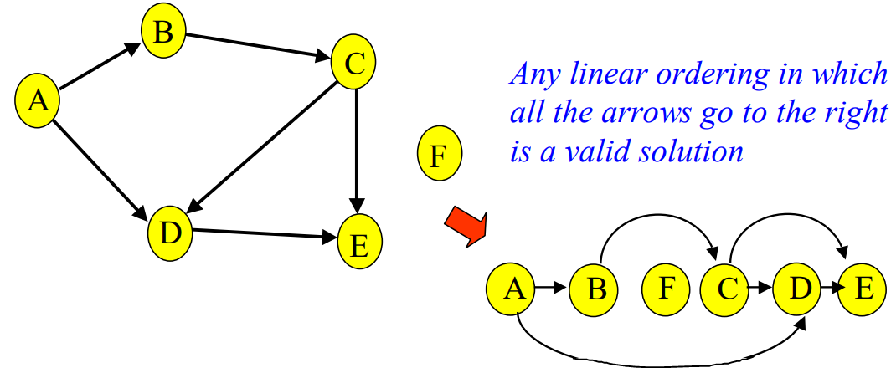

Work in progress
# Problem
Given a directed hierchical structure, how do we flatten it to an array so that the directions are preserved?  

Recall my problem of trying to fly to Beijing, China, while Zero-Covid policy is going on in China, say I have combed through many many flights (edges) and stops (nodes) and have come up with the following possible path.  


How do I write down each of the valid routes in their right order with sentences? 
Before quoting any named algorithm, how would we solve the problem? 

We can write down my starting place first, since it does not have any dependencies. Then we look at where the directed edges lead to, if any of them do not have any dependencies, then we can write it down next. And so forth until we are done. 

My solution seems to resemble Khan's algorithm for topological sort: solving problem layer by layer: start from those that have no dependencies (no incoming edges), remove them and write them down (put them in a queue). Do it to the next batch.

Below images are taken from Washington University Professor Rao's CSE 326 Lecture 20.  The problem is similar, except names of cities have become course numbers.  We want to write down the list of course in their dependency order. 





Here is a different way posing a similar problem:


# Topological sort


<div class="code-head"><span>code</span>khans algorithm.py</div>

```py
from collections import deque
from networkx.generators import directed
from networkx.generators import random_graphs

# Make good adjacency list for testing (is DAG)
g = directed.gn_graph(100)
adj_list = g.adjacency_list()

# Make bad adjacency list for testing (is not DAG)
bad_g = random_graphs.fast_gnp_random_graph(100, 0.2, directed=True)
bad_adj_list = bad_g.adjacency_list()

from collections import deque
from networkx.generators import directed
from networkx.generators import random_graphs

# Make good adjacency list for testing (is DAG)
g = directed.gn_graph(100)
adj_list = g.adjacency_list()

# Make bad adjacency list for testing (is not DAG)
bad_g = random_graphs.fast_gnp_random_graph(100, 0.2, directed=True)
bad_adj_list = bad_g.adjacency_list()

def topsort(adj_list):
  def edges(): # Returns list of edges
    return [val for subl in adj_list for val in subl]

  def no_incoming(): # Generates set of all nodes with no incoming edges
    return set(range(0, len(adj_list))) - set(edges())
  
  L = []                       # L <- Empty list that will contain the sorted elements
  S = deque( no_incoming() )   # S <- Set of all nodes with no incoming edges
  
  while len(S) > 0:            # while S is non-empty do
    n = S.pop()                #   remove a node n from S
    L.append(n)                #   insert n into L
    
    for m in adj_list[n]:      #   for each node m with an edge e from n to m do
      adj_list[n].remove(m)    #     remove edge e from the graph
      
      if m in no_incoming():   #     if m has no other incoming edges then
        S.append(m)            #       insert m into S
  
  if len(edges()) > 0:         # if graph has edges then
    raise Exception("Not DAG") #   return error (graph has at least one cycle)
  else:                        # else
    return L                   #   return L (a topologically sorted order)

```

# Cycle detection

# Compare with Floyd's algorithm for topological sort


# Future reading

[Washington University CSE 326 Lecture 20: Topo-Sort and Dijkstra’s Greedy Idea](https://courses.cs.washington.edu/courses/cse326/03wi/lectures/RaoLect20.pdf)

[Wiki Talk Topological Sorting](https://en.wikipedia.org/wiki/Talk%3ATopological_sorting)
 
