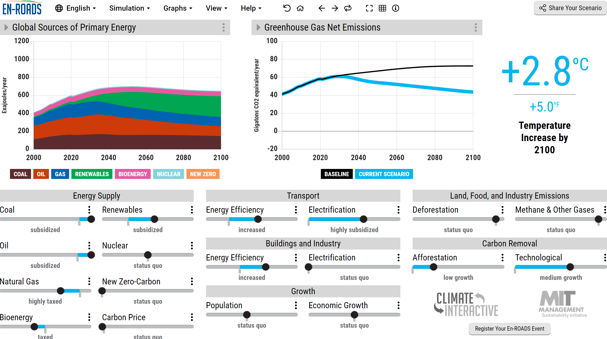

GHG emission has been increasing in a very fast pace since the industrial revolution.  Net Zero means the steady state that GHG in atmosphere is no longer increasing.  In other words, emission released and emission absorbed cancel out each other.  
The focus of GHG is CO2.  CO2 in atmosphere is like a blanket, keeping the Earth warm.   When CO2 increases, the temperature increases.  Most of the energy on the Earth is absorbed by waters (oceans, lakes and rivers).  When temperature warms up, the waters expand in volume.  Melting of the ice add more water.  
### High impact industries
> While all industries will need to adapt, some are much more impacted than others:  **Fossil fuel** (oil, gas and coal), **Power Generation**,  **Metals & Mining** and **Transportation** (including Auto and Aviation). 
 The sectors are not isolated from each other.  For example, some O&G companies are also in the business of renewable energy (wind, solar etc.), EV charging (BP and Shell both own many EV charging stations), and even metals & mining (Exxon has invested in lithium mining);  Furthermore, the dynamics within each sector can differ greatly.  
* **Oil & Gas** - Natural gas is determined as a key energy for energy transition as it has lower emission intensity than oil
* **Coal** - Metallurgical coal is regarded 
* **Power Generation** - Power Generation sector dynamics differ by region.  
* **Metals & Mining** 
* **Auto** - 
* **Aviation** - 
### Opportunities 机会
There are huge opportunities for banks and businesses.  Below screenshot is from Santander 2023 Annual Report.  The bank deemed climate risk is not critical as a risk（风险）, but it is critical as an opportunity （机会）. 

### Adapt and innovate
People are great at adapting.  The history of the O&G industry is one example.  At the beginning, kerosene oil was extracted from crude oil for lights as it was much cheaper than whale fat that was used then for light.  Gasoline and other by products were dumped into the rivers.  It was only when automobile was invented that the use of gasoline as a fuel started.  Then we have petrochemical, and much more.  Look at what we have now: consuming millions of barrels of oil a day.   We will be changing and adapting again. 

For banks, most term loans have maturity of only 3 to 5 years.  When the loans mature, the banks can decide whether to lend again or not.  Both borrowers and lenders have time to adapt and innovate.  

Companies have to be strategic about their transition.  If a company moves too slowly, it may fall behind and become uncompetitive when carbon taxes increase.  But if it moves too fast to renewables or other "green", the cost may be too high to be economically feasible, and this is not sustainable for investors or the company.  For example, some large O&G companies have cut back on their green energy programs.   Changing too fast is often a risk in themselves, as everything in life. 

## Opportunies
Climate risk will not go away and it will only become more important, although it may take a backseat in the context of energy security and national security.  Climate transition is a great opportunity for banks and other financial institutions: carbon credit trading, green financing, transition financing, just to name a few.   Even top O&G companies have positioned themselves to benefit from the transition by filing for carbon technology patents.   The amount of money to be spent on climate-related over the long run will be a similar magnitude as AI. 

### Climate scenarios
From a high level, one may take a look at the interactive scenarios that plays out for the next 80 years. 
[MIT EN-ROADS](https://en-roads.climateinteractive.org/scenario.html?v=24.1.0)

### Climate risk large language models

Banks and financial institutions are combing through reports after reports and hours after hours to review a company on its climate exposure.  It would be great to pre-run a NLP model such as sentiment analysis and text summarization before or in parallel with an analyst. 

In addition, using LLM or ChatGPT-like application to signficantly may reduce the human workload and potentially standardize assessment.   The application can be trained on data such as CDP and company's own sustainability report.   