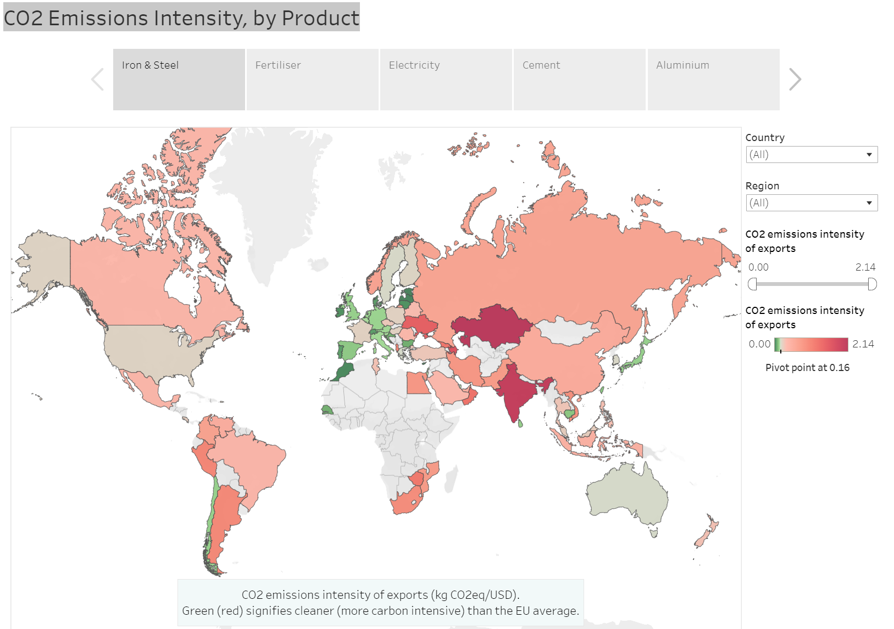
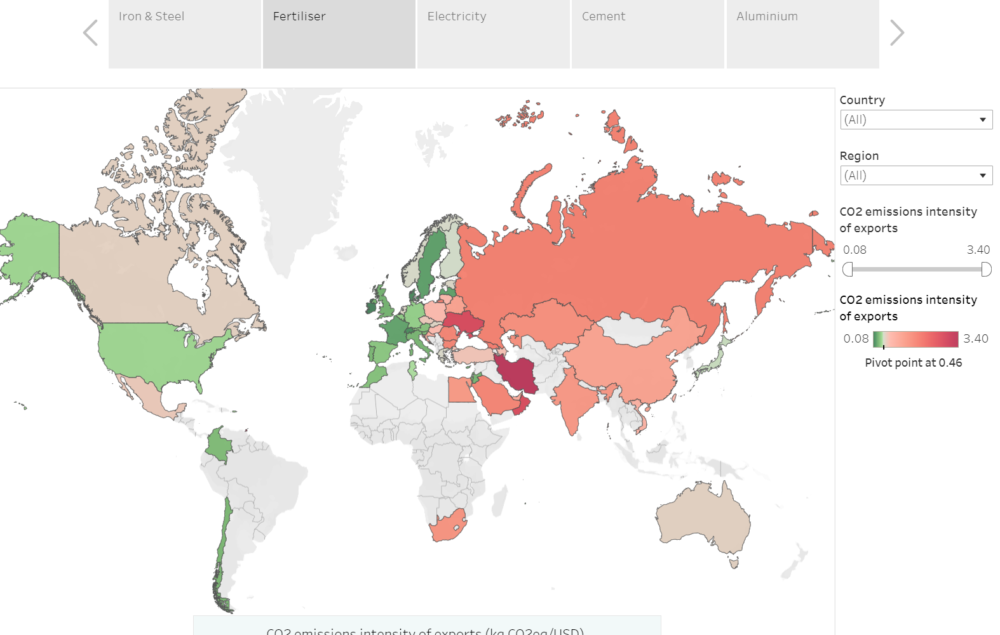
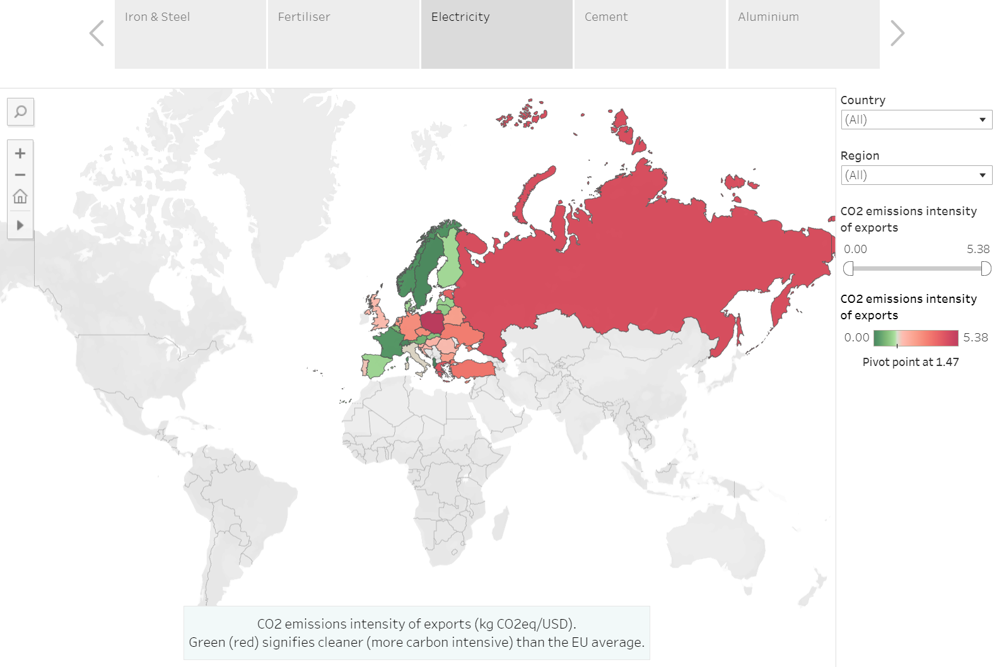

Here's a brief overview of how the EEIO emission model works:

1. **Input-Output Analysis**: Traditional input-output analysis examines the interdependencies between different sectors of an economy by quantifying the flows of goods and services between sectors. This analysis provides a comprehensive picture of economic activities within a region.

2. **Environmental Extensions**: In the EEIO model, environmental data are integrated into the input-output framework. This includes information on emissions of pollutants, resource use, energy consumption, and other environmental impacts associated with each sector of the economy.

3. **Impact Assessment**: Once the environmental data are incorporated, the EEIO model allows for the assessment of environmental impacts associated with different economic activities. This can include quantifying greenhouse gas emissions, air and water pollution, energy consumption, and other environmental indicators.

4. **Policy Analysis and Decision Making**: The EEIO model can be used to evaluate the environmental consequences of different policy scenarios or economic decisions. Policymakers and businesses can use this information to make informed decisions aimed at reducing environmental impacts or improving sustainability.

5. **Data Sources and Analysis Tools**: Developing an EEIO model requires extensive data on economic transactions, environmental emissions, and resource use. This data can come from various sources including national statistics, environmental agencies, industry reports, and research studies. Additionally, specialized software tools are often used to construct and analyze EEIO models.

Overall, the EEIO emission model provides a systematic framework for assessing the environmental impacts of economic activities, helping to inform decision-making processes towards more sustainable and environmentally friendly practices.

# Python

Several Python libraries and frameworks available for conducting environmentally extended input-output (EEIO) analysis and related environmental modeling tasks. Here are a few examples:

1. **Brightway2**: Brightway2 is an open-source framework for life cycle assessment (LCA) and environmental modeling in Python. It provides tools for constructing and analyzing life cycle inventories and impact assessment models, which can include environmentally extended input-output analysis.

2. **PySUT**: PySUT (Python Supply and Use Tables) is a Python library for working with supply and use tables, which are fundamental to input-output analysis. While not specifically focused on environmental extensions, PySUT can be used as a building block for developing EEIO models.

3. **PyIO**: PyIO is a Python library for input-output analysis, which can be extended to include environmental data. While it doesn't directly provide EEIO functionality out of the box, it can serve as a basis for developing custom EEIO models in Python.

4. **PyEconIO**: PyEconIO is a Python library for economic input-output modeling, which can be used to construct input-output tables and conduct various analyses. While its focus is primarily on economic analysis, it can be extended to incorporate environmental data for EEIO modeling.

5. **USEPA's pyIOFramework**: The United States Environmental Protection Agency (EPA) provides a Python framework called pyIOFramework for input-output modeling. While its main focus is on economic analysis, it can be extended to include environmental extensions for EEIO modeling.

These libraries provide a foundation for conducting EEIO analysis in Python, allowing users to integrate economic and environmental data, perform impact assessments, and analyze the environmental implications of economic activities. Users can extend these libraries or develop custom code to incorporate specific environmental data and modeling requirements.

# Companies that produce EEIO models
Several companies and organizations produce software and tools for constructing and analyzing EEIO models. Some of the prominent ones include:

1. **Ecoinvent**: Ecoinvent is a widely used database and software tool for life cycle assessment (LCA) and environmental analysis. It provides comprehensive data on environmental impacts associated with various products and processes, which can be integrated into EEIO models.

2. **OpenIO**: OpenIO is an open-source software platform for building environmentally extended input-output models. It provides a framework for integrating economic and environmental data and conducting impact assessments.

3. **IMPLAN**: IMPLAN is a software tool commonly used for regional economic analysis, including input-output modeling. While it may not focus exclusively on environmental extensions, it can be used in conjunction with environmental data to perform EEIO analysis.

4. **US EPA's USEEIO model**: The United States Environmental Protection Agency (EPA) has developed the USEEIO (US Environmentally-Extended Input-Output) model, which provides a comprehensive database and software tool for analyzing environmental impacts of economic activities in the United States.

5. **Simapro**: Simapro is another widely used software tool for life cycle assessment, which can also be used to construct EEIO models by integrating environmental data with input-output analysis.

These are just a few examples, and there may be other companies or organizations that produce similar software or tools for EEIO modeling. Additionally, academic researchers may develop custom software for specific research projects in this field.

## Trucost
What is Trucost? Trucost is part of S&P Global. A leader in carbon and environmental data
and risk analysis, Trucost assesses risks related to climate change, natural resource
constraints, and broader ESG factors. Companies and financial institutions use Trucost
intelligence to understand their exposure to these factors, inform resilience, and identify
transformative solutions for a more sustainable global economy.

While S&P Trucost may incorporate input-output analysis into their methodologies, they likely use a combination of tools and models tailored to their specific data sources, analytical requirements, and client needs. Therefore, while the EEIO model is a valuable framework for assessing environmental impacts at the macroeconomic level, it may not be the sole or primary model used by S&P Trucost in their environmental analysis and reporting.

2. What is Trucost's “Environmental Register”? Trucost’s Environmental Register is a
database containing information on the direct and supply chain environmental impacts for a
universe of over 15,000 companies, representing 95% of global market capitalization.
Information about each company’s environmental impact is updated annually using a mix of
disclosed and, where gaps are present, modeled data. The data covers hundreds of
environmental issues encompassing carbon and other pollutants, water dependency, natural
resource efficiency, and waste disposal.
RESEARCH PROCESS QUESTIONS
1. What data does Trucost collect from companies? Trucost collects company environmental
data, including performance data and disclosure metrics on greenhouse gas (GHG) emissions,
water use, pollution impacts, and waste disposal. We also collect information on a company's
business activities.
2. What sources does Trucost use in its data collection process? Trucost uses a variety of
publically disclosed sources, such as company financial reports (annual reports, financial
statements, 10-K/20-F reports, SEC/regulatory filings), environmental data sources (corporate
social responsibility [CSR], sustainability, or environmental reports, the CDP, EPA filings), and
data published on company websites or other public sources.
Trucost
FAQ 2
3. In the absence of disclosures, how does Trucost model company impacts? Trucost’s
environmentally extended input-output (EEIO) model combines industry-specific environmental
impact data with quantitative macroeconomic data on the flow of goods and services between
different sectors in the economy. The EEIO model enables us to estimate environmental
impacts for a company’s own operations and across its entire global supply chain. Trucost’s
model calculates environmental impacts per USD 1 million in revenue for each of the 464
business activities in our system, which we can then use to anticipate the most material impacts
for a company based on its business activities.
4. How often is the data updated? Trucost produces annual company assessments to align
reported environmental data with annual company financial reporting. Trucost’s research
process is continuous, so revisions may occur at any point in the year as companies disclose
information and further complete our quality checks, engagement, and data verification steps.
Company data restatements are not typically taken into account in the data, apart from cases in
which there is an error correction provided in the disclosures. However, it is common for a
company’s data disclosure to have valuable information pertaining to previous financial years
(time-series performance) that can allow Trucost to refine its assessment or take a disclosed
value for a prior year instead of previously estimated values.
5. How can I validate the data collected on my company? Once the company's data have
been reviewed by a Trucost sector-specialized analyst, the company's environmental profile is
available to view via Trucost's secure online portal. Companies are invited to respond to
Trucost to verify its data or directly engage in order to provide either refined, additional, or nonpublic data. Where Trucost deems any additional data from this process useful, it will quality
check the data and integrate them into the analysis.
6. Can I make changes to the data collected on my company? You will have the opportunity to
review or amend the data collected on your company during the data validation process (see
response to question 5).
7. If I provide information to Trucost privately, will it be made public? All company
information provided privately to Trucost will be treated in the same way as information collected
from publicly available sources. If privately provided information is incorporated into Trucost's
research on your company, it will be available to subscribers of Trucost data services. Any data
provided directly by a company will be flagged as such, so that users understand the source of
each data field.
8. Where can I learn more about the data collection and modeling process? For more
information about Trucost's data collection and modeling process, please contact
trucostinfo@spglobal.com.
SPECIFIC CONCEPTS
9. What is a “carbon intensity” metric? “Carbon intensity” is a metric that denominates a
quantity of GHG emissions (e.g., tonnes of carbon dioxide equivalent [tCO2e] emissions) with
another data point: a normalizing factor. Trucost’s standard metric, which is perhaps the most
widely used carbon intensity metric, denominates emissions by a company’s annual
consolidated revenues in millions of U.S. dollars: tCO2e/USD 1 million revenue.
Trucost
FAQ 3
Carbon intensities are useful in comparing companies within and across different sectors. They
can act as a control for different company characteristics, such as size, making it possible to
assess the carbon efficiency of a company. Trucost’s default carbon intensity metric is carbon
to revenue in metric tons CO2e per USD 1 million revenues, which is defined as “the
aggregation of operational and first-tier supply chain carbon footprints of index constituents per
USD 1 million in revenue”.
10. Why are carbon intensities calculated using revenues? GHG emissions are generated by a
company’s direct and indirect operations, so a suitable normalizing factor should also be
correlated with direct and indirect operations in order to reflect the carbon efficiency of a
company. Since a company’s revenues can be reasonably correlated with its scale of
operations, at least within a sector, revenues have become the market-standard carbon
intensity normalizing factor.
Linking the carbon intensity metric to a company’s financial performance allows us to begin to
understand the relationship between GHG emissions and financial risk. The tCO2e/USD 1
million revenue metric indicates the dependency on the generation of GHG emissions that a
company has when generating revenues.
11. What are “direct” and “first-tier indirect” emissions, and how do they differ from the GHG
Protocol's scopes 1, 2, and 3? Direct and first-tier indirect emissions are Trucost’s default
emission scopes, which differ slightly from the GHG Protocol’s scopes 1 and 2.
Scope 1 emissions are from directly emitting sources that are owned or controlled by a
company. For example, scope 1 includes the emissions produced by the internal combustion
engines of a trucking company’s trucking fleet.
Scope 2 emissions are from the consumption of purchased electricity, steam, or other sources
of energy generated upstream from a company’s direct operations.
Scope 3 encompasses all other emissions associated with a company’s operations that are not
directly owned or controlled by the company. Therefore, scope 3 emissions include several
sources of indirect emissions in both the company’s supply chain and downstream from the
company’s owned or controlled operations (e.g., the emissions from the in-use phase of a
company’s products or services, such as the driving of a truck produced by an automobile
manufacturer). By such a definition, scope 3 emissions are attributed the largest quantity of a
company’s emissions footprint.
Trucost defines direct emissions as the GHG Protocol’s scope 1 emissions, plus any other
emissions derived from a wider range of GHGs relevant to a company’s operations. First-tier
indirect emissions are defined as GHG Protocol scope 2 emissions, plus the company’s first-tier
upstream supply chain—their direct suppliers. The goal of this enhancement is to include some
of the company’s most relevant upstream scope 3 emissions, while limiting the extent of the
double counting of emissions. The upstream supply chain of companies in Trucost’s database
is calculated using its EEIO model.

# Cross Border Adjustment Mechanism

The EU's Cross Border Adjustment Mechanism is to prevent CO2 emissions from leaking out of the EU by adjusting prices at borders taking into account CO2 emissions.  

The CBAM is designed to b compatible with WTO rules.

On Aug 17, 2023, the European Commision adopted the rules governing the implementation of CBAM during its transitional phase, which started on Oct 1, 2023 and runs until end of 2025.

Jan 1, 2026: importers will need to declare each year the ***quantity of goods*** imported into the EU in the preceding year and ***their embedded GHB***.   They will then surrender the corresponding number of *CBAM certificates*.  The price of the certificate will be <u>calculated depending on the weekly average auction price of EU ETS allowances expressed in €/tonne of CO2 emitted.</u>

> If importers can prove that a carbon price has already been paid during the production of the imported goods, the corresponding amount can be deducted.

# CBAM transitional phase (2023 – 2026)
Oct 1, 2023: the CBAM entered into application in its transitional phase, with the first reporting period for importers ending Jan 31, 2024. The gradual phasing in of CBAM allows for a careful, predictable and proportionate transition for EU and non-EU businesses, as well as for public authorities.

The CBAM will initially apply to imports of certain goods and selected precursors whose production is carbon intensive and at most significant risk of carbon leakage: 
- cement 水泥
- iron  铁
- steel 钢
- aluminium 铝
- fertilisers 化肥
- electricity 电
- hydrogen 氢

CBAM will eventually – when fully phased in – capture more than 50% of the emissions in ETS covered sectors. The objective of the transitional period is to serve as a pilot and learning period for all stakeholders (importers, producers and authorities) and to collect useful information on embedded emissions to refine the methodology for the definitive period.

During this period, importers of goods in the scope of the new rules will **only have to report** GHG embedded in their imports (*direct and indirect emissions*), without the need to buy and surrender certificates. 

For cement and fertilisers, indirect emissions will be covered in the scope after the transitional period. 

The Implementing Regulation on reporting requirements and methodology provides for some flexibility when it comes to the values used to calculate embedded emissions on imports during the transitional phase. Until the end of 2024, companies will have the choice of reporting in three ways: 

**EU method**: full reporting according to the new methodology

**equivalent method**: reporting based on an equivalent method (three options)

**Default reference values**: reporting based on default reference values (only until July 2024).

As of Jan 1, 2025, only the EU method will be accepted and estimates (including default values) can only be used for complex goods if these estimations represent less than 20% of the total embedded emissions. The Commission published default values on 22 December 2023. This report from the EU’s Joint Research Centre (JRC) fed into the preparation of those default values.

The Commission has also developed dedicated IT tools to help importers perform and report these calculations, as well as in-depth guidance, training materials and tutorials to support businesses in this transitional phase.

A review of the CBAM's functioning during its transitional phase will be concluded before the entry into force of the definitive system. At the same time, the product scope will be reviewed to assess the feasibility of including other goods produced in sectors covered by the EU ETS in the scope of the CBAM mechanism, such as certain downstream products and those identified as suitable candidates during negotiations. The report will include a timetable setting out their inclusion by 2030.

# Who are most at risk

The World Bank publishes a good visualization on [CBAM exposure](https://www.worldbank.org/en/data/interactive/2023/06/15/relative-cbam-exposure-index#1) and provide underlying data.  It uses a metric called "Relative CBAM Exposure Index".    "The Relative CBAM Exposure Index is designed to identify countries with a high exposure to the EU CBAM, using carbon emissions intensity and exports of CBAM products to the EU. Assuming the carbon price ($100 per metric ton), the index measures the additional cost of CBAM certificates for exporters compared to the average EU producer, adjusted by the proportion of exports to the EU market."   

It recognizes cost changes in the EU market, where EU producers also bear emissions costs, enabling relatively clean exporters to gain competitiveness despite the requirement to purchase certificates. 

# Who can help with CBAM reporting

There are already companies working on providing help with reporting such as Carbon Chain.  I am working on one myself as well with advanced scholars in environmental scientists from MIT and Carnegie Mellon. 

# References

[S&P TruCost FAQ](https://www.spglobal.com/spdji/en/documents/additional-material/faq-trucost.pdf)

[Carbon Border Adjustment Mechanism, Taxation and Customs Union, European Commission](https://taxation-customs.ec.europa.eu/carbon-border-adjustment-mechanism_en)

[EU Emissions Trading System (EU ETS)](https://climate.ec.europa.eu/eu-action/eu-emissions-trading-system-eu-ets_en)

[Carbon Chain CBAM Reporting](https://www.carbonchain.com/cbam/cbam-declaration-report)
## Videos

[KPMG Ireland: Carbon Border Adjustment Mechanism](https://www.youtube.com/watch?v=o-9Q61yMATY)

[PWC EU Carbon Border Adjustment Mechanism (CBAM) Webcast Series - Event 1 Introduction to CBAM](https://www.youtube.com/watch?v=H5B2tG_mBfU)

[5分鐘了解 你不可不知的 歐盟碳邊境調整機制 (CBAM) 【2021草案版】](https://www.youtube.com/watch?v=sh26BeSWPhA)

[歐盟碳關稅將上路！憂衝擊台灣螺絲王國地位 經濟部編列8億助1600業者減碳｜非凡財經新聞｜20230208](https://www.youtube.com/watch?v=K6s_7u3DQXo)

[不可不知的CBAM 重擊:碳邊界調整機制的基本概念和影響](https://www.youtube.com/watch?v=fHiDjqCEsfs)

[台灣碳權交易所成立，碳抵換仍有爭議｜零碳焦慮](https://www.youtube.com/watch?v=OQtD8l36uKc&t=529s)

[歐碳關稅15年長跑達協議 2023年10月試營開徵](https://www.youtube.com/watch?v=LEntBU1VHYY)